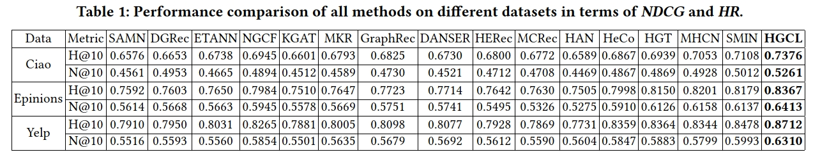

# HGCL
 


Torch version is available now!
This repository contains pyTorch code and datasets for the paper: **Heterogeneous Graph Contrastive Learning for Recommendation**, *Paper in arXiv, Paper in ACM. In WSDM'23, Singapore, 2023

### Inroduction  
**Heterogeneous Graph Contrastive Learning for Recommendation (HGCL)** advances the recommender system with heterogeneous graph contrastive learning. HGCL integrates meta network with contrastive learning for adaptive augmentation to enable user-specific and item-specific knowledge transfer. It advances graph contrastive learning with customized cross-view augmentation.

### Environment
The codes of HGCL are implemented and tested under the following development environment: 
pyTorch:
	Python=3.7.10
	Torch=1.8.1
	Numpy=1.20.3
	Scipy=1.6.2
### Datasets
We utilized three datasets to evaluate HGCL: *Yelp*, *Epinions*, and *CiaoDVD*. Following the common settings of implicit feedback, if user u_ihas rated item v_j, then the element (u_i,v_j) is set as 1, otherwise 0. We filtered out users and items with too few interactions. The datasets are divided into training set and testing set by 1: (n-1).

You can download all three datasets from [Google Drive](https://drive.google.com/drive/folders/1s6LGibPnal6gMld5t63aK4J7hnVkNeDs?usp=sharing). 
Feel free to fire an issue if this link doesn't work.

### How to Run the Code
Please unzip the datasets first. Also you need to create the History/ and the Models/ directories. The command to train HGCL on the Yelp/Epinions/CiaoDVD dataset is as follows. The commands specify the hyperparameter settings that generate the reported results in the paper.
* Yelp
```
python main.py --dataset Yelp --ssl_temp 0.5 --ssl_ureg 0.06 --ssl_ireg 0.07 --lr 0.058 --reg 0.05 --ssl_beta 0.45 --rank 3
```
* Epinions
```
python main.py --dataset Epinions --ssl_temp 0.5 --ssl_ureg 0.04 --ssl_ireg 0.05 --lr 0.055 --reg 0.043 --ssl_beta 0.32 --rank 3
```
* CiaoDVD
```
python main.py --dataset CiaoDVD --ssl_temp 0.6 --ssl_ureg 0.04 --ssl_ireg 0.05 --lr 0.055 --reg 0.065 --ssl_beta 0.3 --rank 3
```


### Important arguments
* `--ssl_temp` It is the temperature factor in the InfoNCE loss in our contrastive learning. The value is selected from {0.1, 0.3, 0.45, 0.5, 0.55,0.6, 0.65}.
* `--ssl_ureg, ssl_ireg` They are the weights for the contrastive learning loss of user’s and item’s aspect respectively. The value of this pair are tuned from 
{(3e-2,4e-2),( 4e-2,5e-2),( 5e-2,6e-2), (6e-2,7e-2),( 7e-2,8e-2)}.
* `--lr` The learning rate of the mode. We tuned it from
{1e-2, 3e-2, 4e-2, 4.5e-2, 5e-2, 5.5e-2, 6e-2}.
* `--Reg` It is the weight for weight-decay regularization. We tune this hyperparameter from the set {1e-2, 3e-2, 4.3e-2, 5e-2, 6e-2, 6.5e-2, 6.8e-2}.
* `--ssl_beta` This is the balance cofficient of the total contrastive loss , which is tuned from{0.2, 0.27, 0.3, 0.32, 0.4, 0.45, 0.48, 0.5}.
* `--rank` A hyperparameter of the dimension of low rank matrix decomposition, This parameter is recommended to tune from{1, 2, 3, 4, 5}.
### Experimental Results
Performance comparison of all methods on different datasets in terms of *NDCG* and *HR*:
<p>
  
  <br />
</p>

## Citation
If you find this work helpful to your research, please kindly consider citing our paper.
```
@inproceedings{chen2023heterogeneous,
  title={Heterogeneous graph contrastive learning for recommendation},
  author={Chen, Mengru and Huang, Chao and Xia, Lianghao and Wei, Wei and Xu, Yong and Luo, Ronghua},
  booktitle={Proceedings of the Sixteenth ACM International Conference on Web Search and Data Mining},
  pages={544--552},
  year={2023}
}
```
